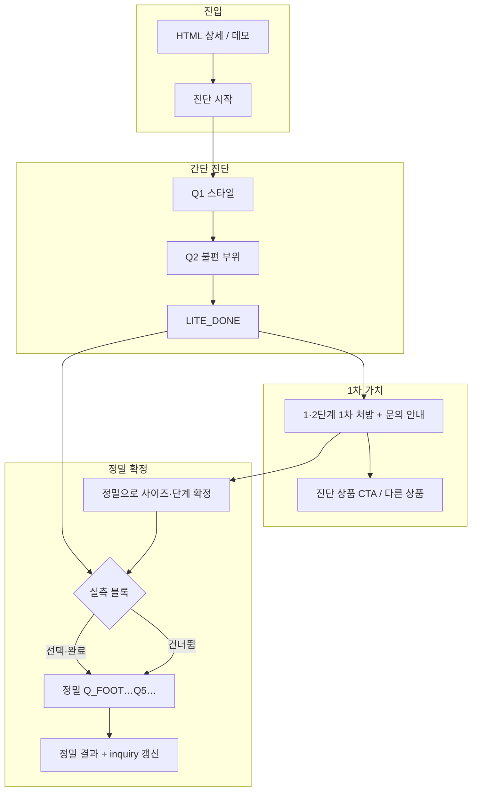

# 설계안: Lite → 1·2단계(1차) → 정밀 + 실측 수집

**버전:** draft-20260529  
**목적:** 쿠팡 파일럿 UX 단순화, 문의용 1·2단계 1차 처방, 정밀 진단 업셀, 발길이·발볼 실측 데이터 축적  
**범위:** `session.py` 상태머신, `lite_diagnosis` / `comfort_result_copy`, `engine.py` 연동(1차는 규칙표, 2차는 기존 엔진), `/demo`·`product_detail.html`

---

## 1. 목표와 원칙

| 목표 | 원칙 |
|------|------|
| 진입 마찰 감소 | 기본 퍼널은 **한 갈래(Lite)**; 정밀·실측은 **이어하기·고위험**에서만 |
| 쿠팡 전환 | Lite 직후 **발볼 늘림 1·2단계(1차)** + 문의 복사·CTA |
| 데이터 | 실측은 **선택 기본**, 조건 충족 시 **권장/강조**; DB·RAG 필드 재사용 |
| 엔진 정직성 | Lite 1·2단계 ≠ Full 최종; 문구에 **1차 / 최종** 라벨 고정 |
| 민감정보 | 발 치수는 기존 `customer_inputs`·보관·purge 정책 준수 |

---

## 2. 고객 여정 (목표)



**진입 UI (쿠팡·상세):**

- 기본 CTA: **「발 맞춤 진단 시작」** → `mode=lite` (또는 단일 `/demo` 부트)
- 보조 링크(작게): **「바로 정밀 진단」** → `mode=full` (기존 딥링크 유지)
- `Q_ENTRY` 이분(간단/정밀 큰 버튼)은 쿠팡 트래픽에서 **숨기거나 1버튼으로 축소**

---

## 3. Lite 1·2단계(1차 처방) — 엔진과 분리

Full `DiagnosisEngine`을 Lite 2문만으로 돌리지 않는다. **Lite 전용 규칙표**로 1차만 산출한다.

### 3.1 입력

- `lite_q1` (스타일) → `design` 힌트
- `lite_q2` (불편) → `pain` (`hallux` | `wide_ball` | `high_instep` | `edema`)

### 3.2 출력 (화면·복사본)

| pain | 1차 stretch_step (초안) | 비고 |
|------|-------------------------|------|
| `wide_ball` | 1 (기본) / q2=넓음 강하면 2 검토 | 문의에 「발볼 늘림 N단계(1차)」 명시 |
| `hallux` | 1 + 앞코/핀포인트 **문구** (가공은 문의) | 2단계 자동 상한 2 |
| `high_instep` | 0 (핏·사이즈 문구 우선) | 발볼 늘림보다 **한 치수 업 검토** 안내 |
| `edema` | 0 | 여유 핏 권고 |

- 본문 라벨: `[쿠팡 맞춤 안내 · 간단 진단 · 1차]`
- 하단 고정: `COUPANG_INQUIRY_HINT` + 「정밀 진단으로 사이즈·단계 **최종 확정**」
- `inquiry_copy_text`의 `stretch_step` / `stretch_mm`는 1차 값으로 채움 (Full 완료 시 **덮어쓰기**)

### 3.3 모듈 배치

- 신규: `lite_stretch_policy.py` (또는 `comfort_result_copy` 내 함수 1개) — `pain`, optional severity → `(step, mm, reason_short)`
- `build_coupang_lite_result_display()`가 위 결과를 상단에 요약 1~2줄로 노출

---

## 4. 정밀 진단 + 실측 블록

### 4.1 실측 질문 (기존 상태 재사용)

| 상태 | 질문 | 검증 |
|------|------|------|
| `Q_MEAS` | 지금 발길이·발볼 너비를 재서 알려주실 수 있을까요? | 네 / 아니요 / **나중에**(신규 선택지 검토) |
| `Q_MEAS_INPUT` | **발볼 너비** (가장 넓은 부위) | 70–130; 단위 안내: mm 너비 또는 cm(9.2) |
| `Q_MEAS_LENGTH` | **발 실제 길이** (뒤꿈치~발끝) | 200–280 mm |

**Q5 `Q_SIZE`와 문구 분리 (필수):**

- 실측 발길이: 「발 끝까지 재신 길이(mm)」
- Q5: 「**지금 신고 계신 신발** 옵션 사이즈(mm)」 — 엔진 `original_size` 앵커

### 4.2 실측 블록 삽입 위치 (설계 결정)

| 경로 | 현재 | 변경 후 |
|------|------|---------|
| Full 진입 「발 정보 우선」 | `Q_FULL_ENTRY` → `Q_MEAS` | **유지** |
| Full 「상품 먼저」 | `Q_DESIGN` → … → `Q_SIZE` (실측 없음) | `Q_DESIGN`·`Q_FOOT` **전** 또는 `Q_SIZE` **직전**에 `Q_MEAS` **1회** (이미 `measurement_available` 있으면 스킵) |
| Lite → 「정밀 이어하기」 | `Q_SIZE` 직행 | **`Q_MEAS` → (선택) → `Q_FOOT` 또는 `Q_SIZE`** (아래 4.3) |
| `mode=full` 딥링크 | `Q_FULL_ENTRY` | 유지; 상품/발 분기 후 동일 규칙 |

**Lite 이어하기 권장 순서:**

```text
LITE_DONE → [정밀 확정 선택]
  → Q_MEAS (선택)
  → Q_FOOT (lite prefill 반영, 증상 보강 가능)
  → Q_DESIGN (이미 lite q1 있으면 확인만/스킵 가능)
  → Q_SIZE → Q_SIZE_FIT → Q_FIT_EXP → …
```

- `apply_prefill_to_session()` 유지: design / foot_issues / severity
- design이 이미 있으면 `Q_DESIGN`은 **확인 1턴** 또는 자동 스킵(구현 시 플래그 `lite_design_confirmed`)

### 4.3 실측 강조(권장) 조건 — 2단계

**Phase A (세션만):** 아래 중 하나면 `Q_MEAS` 문구에 「정확한 처방을 위해 실측을 권장드려요」 배지.

- `foot_issues` 3종 이상 또는 무지외반+넓음+발등
- Lite q2=무지외반 또는 hallux severity ≥ 2 (prefill)
- `fit_experience` = 꽉낌/헐떡임 (Q5 이전엔 아직 모름 → Phase B)

**Phase B (엔진 연동):** `DIAGNOSING` 직전 proxy 점수(세션에 `_estimate_composite` 경량 함수) ≥ 4 → 결과 화면에 「실측 후 재진단」 링크 또는 다음 세션 `Q_MEAS` 유도. (TC20 정책과 정렬, **강제 중단은 하지 않음** — 이탈 방지)

### 4.4 엔진 적용 (현행 유지 + 문서화)

| 필드 | 정밀 결과에 미치는 영향 |
|------|-------------------------|
| `foot_ball_width_mm` + `measurement_available` | 핏 단계 자동 (`_fit_from_measured_ball_width`) |
| `foot_length_mm` | **최종 mm 사이즈 산출 주력 아님**; 꽉낌+실측 시 A/B 옵션 문구 |
| `original_size` (Q5) | `_adjust_size` 앵커 |

**설계상 명시:** 발길이만으로 권장 사이즈를 바꾸지 않는다(오판·반품 리스크). 향후 v2에서 `foot_length_mm` vs `original_size` 차이 > X mm일 때 **상담 플래그**만 추가 검토.

---

## 5. 상태머신 변경 요약

```mermaid
stateDiagram-v2
  [*] --> Q_ENTRY
  Q_ENTRY --> Q_LITE_1: coupang_default
  Q_ENTRY --> Q_FULL_ENTRY: mode_full_link
  Q_LITE_1 --> Q_LITE_2
  Q_LITE_2 --> LITE_DONE
  LITE_DONE --> Q_MEAS: continue_full
  Q_MEAS --> Q_MEAS_INPUT: yes
  Q_MEAS --> Q_FOOT: no
  Q_MEAS_INPUT --> Q_MEAS_LENGTH
  Q_MEAS_LENGTH --> Q_FOOT
  Q_FOOT --> Q_FOOT_DETAIL: needs_detail
  Q_FOOT --> Q_DESIGN: done_foot
  Q_FOOT_DETAIL --> Q_DESIGN
  Q_DESIGN --> Q_SIZE: product_first_or_after_foot
  note right of Q_MEAS: 상품먼저 경로도\n동일 블록 삽입
  Q_SIZE --> Q_SIZE_FIT --> Q_FIT_EXP
  Q_FIT_EXP --> Q_TIGHT_HEEL_ON_UP: tight
  Q_FIT_EXP --> DIAGNOSING: else
  Q_TIGHT_HEEL_ON_UP --> DIAGNOSING
  DIAGNOSING --> RESULT
```

**신규/변경 플래그 (세션 JSON):**

| 필드 | 용도 |
|------|------|
| `intake_path` | `coupang_lite` \| `full_direct` \| `lite_then_full` |
| `lite_stretch_primary` | `{step, mm}` 1차 처방 스냅샷 |
| `measurement_skipped` | bool — 분석 시 코호트 |
| `foot_length_mm` / `foot_ball_width_mm` | 기존 |

---

## 6. API·UI·문서

| 항목 | 변경 |
|------|------|
| `/demo` | 쿠팡 `product_id` 있으면 부트 **lite only**; 빌드 태그로 배포 확인 |
| `product_detail.html` | 주 CTA 1개 + 보조 정밀 링크 |
| `inquiry_copy_text` | Lite: 1차 stretch; Full 완료: **최종** stretch로 replace |
| `POST /ops/cta-event` | 기존 유지; optional `lite_primary_done` 이벤트 |
| `02_architecture.md` | 본 설계 § 링크 1줄 |
| `COUPANG_INQUIRY_INTEGRATION.md` | 1차/최종 라벨 |

---

## 7. 데이터·보안

- 저장: 기존 `save_customer_input` — 변경 없음
- 로그: 실측 값 **원문 금지**; `has_measurement`, `ball_width_bucket`, `length_bucket` 해시/구간만 JSONL (선택 Phase C)
- 보관: `scripts/data_retention_admin.py` 대상에 발 치수 포함 명시
- RAG export: 실측 포함 시 문서에 **익명·구간화** 검토 (Phase C)

---

## 8. 구현 단계 (권장)

| 단계 | 내용 | 산출 |
|------|------|------|
| **P0** | Lite 1·2단계 규칙표 + `build_coupang_lite_result_display` | 쿠팡 Lite 결과에 1차 단계 노출 |
| **P1** | `LITE_DONE` → `Q_MEAS` → `Q_FOOT` 순서, Q5/실측 문구 분리 | 이어하기 경로 수집률 ↑ |
| **P2** | 상품 먼저 경로에 `Q_MEAS` 삽입 | Full 전 경로 수집 |
| **P3** | 진입 UI 단일 CTA + `product_detail` | UX 중복 제거 |
| **P4** | 고위험 실측 권장 문구 + (선택) proxy 점수 | TC20 방향 |
| **P5** | 로그 버킷·보관 문서 | 운영·과제 증빙 |

**회귀:** `demo_replay_3cases.py`, TESTSET TC02·TC17·TC20 — Full 경로만; Lite 경로 스모크 3케이스 추가.

---

## 9. KPI

| 지표 | 정의 |
|------|------|
| Lite 완료율 | `LITE_DONE` / `chat_start` (coupang cohort) |
| 1차→정밀 | `lite_then_full` / Lite 완료 |
| 실측 수집률 | `measurement_available=true` & 두 필드 not null / 정밀 시작 |
| 1차≠최종 단계율 | `lite_stretch_primary.step` ≠ Full `stretch_step` (모델 튜닝) |
| 전환 | `cta_buy_diagnosed` / 진단 완료 |

---

## 10. 열린 결정 (구현 전 확정)

1. **「나중에」** 실측 선택지 — 허용 시 `measurement_skipped=true`만 기록  
2. Lite 이어하기 시 **Q_FOOT 생략** 허용 여부 (prefill만으로 DIAGNOSING 가능한지 — 정책상 **최소 1회 증상 확인 권장**)  
3. `high_instep` / `edema` Lite 1차에서 stretch 0 고정 vs 1 단계 예외  
4. Phase B proxy 점수를 세션에 넣을지, 엔진 `composite_score`를 미리 호출할지(비용)

---

## 11. 관련 파일

- `session.py` — 상태 전이  
- `lite_diagnosis.py`, `comfort_result_copy.py`  
- `engine.py` — `CustomerInput`, measured path  
- `storage.py`, `api.py`, `docs/demo/product_detail.html`
