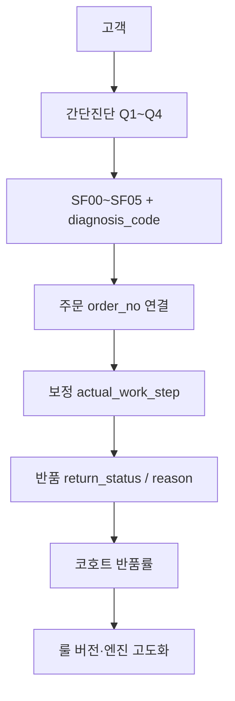

# 파일럿 데이터·반품 루프 (AS-IS ↔ TO-BE 매핑)

버전: 20260610-complex-policy  
목적: **진단 ↔ 주문 ↔ 보정 ↔ 반품**을 `diagnosis_id`로 연결해 반품률 분석 → 룰/엔진 개선.  
대외(사업·기획)용 5테이블 설계는 **TO-BE**; 실제 수집은 **`pilot_diagnoses` 등 AS-IS**에 쌓는다.

## 1. 목표 흐름

**연결 키 (이름 사용 금지)**

| 용도 | 필드 |
|------|------|
| DB 내부 PK | `pilot_diagnoses.id` (UUID) |
| 문의·고객 표기 | `diagnosis_code` (예: `SF01-000056`) |

## 2. TO-BE(5테이블) ↔ AS-IS(현재 repo)

| TO-BE (기획 문서) | AS-IS (SQLite) | 비고 |
|-------------------|----------------|------|
| `diagnosis` | `pilot_diagnoses` | q1~q4, `recommendation_code`, `complex_case`, `precision_recommended` |
| `diagnosis.sf_code` | `recommendation_code` | 동일 |
| `diagnosis.sku_id` | `product_id` | 상품/SKU |
| `precision_diagnosis` | 같은 행: `left_*_mm`, `right_*_mm`, `photo_storage_key` | 정밀 완료 시 |
| `order` | `order_no`, `product_id`, `channel` | `size_ordered`·`purchase_date`는 추후 컬럼 |
| `fitting.stretch_level` | `actual_work_step` (1/2) | 관리자 입력 |
| `return` | `return_status`, `return_reason` | 같은 행 |
| (없음) | `pilot_orders` | **진단 없는 주문** 대조군 |
| (없음) | `pilot_funnel_events` | 상세·복사·정밀 행동 (`diagnosis_id` 연동) |

### MVP 9필드 (분석 최소)

| 기획 필드 | 우리 컬럼/출처 |
|-----------|----------------|
| diagnosis_id | `id` + `diagnosis_code` |
| q1~q4 | `q1`, `q2_json`, `q3`, `q4` |
| sf_code | `recommendation_code` |
| sku_id | `product_id` |
| order_id | `order_no` |
| return_yn | `return_status` (0/1) |

## 3. 이번에 추가한 AS-IS 보강 (20260610)

| 항목 | 설명 |
|------|------|
| `pilot_rule_version` | 룰/문구 배포 세대 (`pilot_engine.PILOT_RULE_VERSION`) |
| `engine_hint_json` | SF → `policy_n`, `stretch_step`, `primary_axis` (`sf_engine_hint`) |
| `precision_selected` | 정밀 폼 진입 시 1 (`precision_form_view` + diagnosis_id) |
| 퍼널 `diagnosis_id` | `pilot_result_view`, `pilot_copy_inquiry` 등 진단 단위 추적 |

`/health/build` → `pilot_rule_version` 확인.

## 4. SF ↔ engine.py (분석 힌트만)

고객 처방 확정이 아니라 **나중에 full 엔진·핏라인과 맞출 때 쓰는 메타**.

| SF | policy_n (등가) | stretch_step | primary_axis |
|----|-----------------|--------------|----------------|
| SF00 | 0 | 0 | none |
| SF01 | 1 | 1 | stretch_or_fit |
| SF02 | 2 | 2 | stretch_or_size |
| SF03 | 2 | 0 | size_up |
| SF04 | 0 | 0 | consult_or_size |
| SF05 | 0 | 0 | length_instep_after_precision |

상세 룰: `docs/plans/PILOT_ENGINE_RULES.md`, 등가: `docs/plans/Q5_TIGHT_POLICY_TABLE.md`.

## 5. 복합증상 정책

**팀 합의 (한 줄)**

> 복합일 때 당장 SF02로 올리지 않고 SF01(등)으로 두고 데이터를 쌓은 뒤, 반품·정합·정밀 효과를 본 다음에만 「정밀 강화 / 문구·provisional / (일부만) SF02·룰 v2」를 고른다.

### 지금 (데이터 쌓기 전)

| 구분 | 동작 |
|------|------|
| SF 코드 | Q1·Q3·(일부 Q2) **기존 elif**만 — `complex_case`로 SF01→SF02 **자동 승격 없음** |
| 복합 감지 | `compute_complex_case(q2)`: Q2 **2곳 이상** 또는 **무지외반 단독** → `complex_case=1` |
| 정밀 플래그 | 복합이면 보통 `precision_recommended=1` (판정 코드와 별개) |
| 예시 | Q2 여러 곳 + 가벼운 불편 + 발볼 조임 → **SF01**이면 코드는 SF01, 복합 플래그만 추가 |

「복합인데 SF01」은 버그가 아니라, 복합을 **SF06·elif 예외로 쪼개지 않기로 한 설계**다. **SF00~05 축은 동결**하고 코호트를 넓게 유지한다.

### 나중 (코호트·반품 검증 후)

`pilot_rule_version`을 올리며 **아래 중 하나씩** 검토한다. **「복합 = 전부 SF02」 일괄 규칙은 금지.**

1. **정밀 진단** — 복합+SF01 반품이 높으면 **SF01 유지**, 정밀 노출·문구·(선택) provisional 안내만 강화. SF03/SF04 승격은 **Q1·Q3가 이미 그쪽일 때만** (현행 룰).
2. **SF01→SF02 (신중)** — 예: 「복합+SF01+주증상 무지외반+매우 불편」 서브그룹만 반품 높음 → **그 코호트에만** 룰 v2에서 SF02 후보 검토.
3. **문구·운영** — 코드 SF01 유지, 복사문에 「1차·확정은 정밀/문의」, `actual_work_step` 정합 SOP.

**결정용 비교 예:** `complex_case=1` & `recommendation_code=SF01` & `order_no` 있음 → 반품률 vs `complex_case=0` SF01, vs 정밀 완료군 (**n·기간·`pilot_rule_version` 동일**).

### 분기 대신 라벨 (추후, 미구현)

Q2 복합 시 **「가장 먼저 편해지면 좋은 곳」** 단일 선택 → DB에 `primary_pain_area` 등 **기록용** 저장. **SF 판정에는 사용하지 않음** — 분석 시 `SF × complex × primary_pain_area × return` 코호트용.

코드: `pilot_engine.compute_complex_case`, `precision_recommended`.

## 6. 운영 SOP (주 1회)

1. 쿠팡 문의에서 **`diagnosis_code`** + **주문번호** 확인  
2. 관리자 `/admin` → 해당 진단에 `order_no`, `actual_work_step`, 반품 Y/N·사유  
3. KPI: **연결률** (order_no 있는 진단 / 전체), **코호트 반품률** (`return_rate_by_cohort`)  
4. 룰 변경 시 `PILOT_RULE_VERSION` bump + `scripts/test_pilot_rules.py` 통과

## 7. 분석 예시 (표본 n 충분할 때)

- SF별 반품률 (`recommendation_code` × `return_status`)  
- 복합 vs 비복합 (`complex_case`)  
- 정밀 선택/완료 (`precision_selected`, `precision_completed`)  
- 처방 vs 가공 정합 (`recommendation_code` vs `actual_work_step`)

## 8. 추후 TO-BE 이관 (표본·API 성숙 후)

- `order` / `fitting` / `return` 테이블 분리  
- `size_ordered`, `purchase_date`, `instep_adjust`, `service_date` 컬럼  
- 쿠팡·네이버 주문 API 자동 연동  

**지금은 테이블 분리보다 `pilot_diagnoses`에 데이터가 쌓이는 것이 우선.**

## 관련 코드

- `pilot_storage.py` — `create_diagnosis`, `record_funnel_event`, `return_rate_by_cohort`  
- `pilot_engine.py` — `PILOT_RULE_VERSION`, `sf_engine_hint`, `evaluate`  
- `docs/runbooks/coupang/COUPANG_DEPLOY_CHECKLIST.md` — 쿠팡 배포·연동 순서·게이트  
- `docs/runbooks/coupang/COUPANG_INQUIRY_INTEGRATION.md` — 문의 복사 여정
